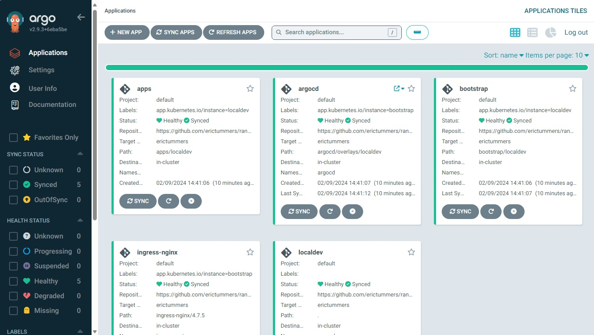

# argocd

## Install

First create a certificate to use for https connections. This is needed to get the GUI available with nginx ingress. Create the tls secret with the lines below in the argocd namespace.

```bash
openssl req -x509 -nodes -days 365 -newkey rsa:2048 -keyout server.key -out server.crt -subj "/CN=*.localdev.me"
kubectl create namespace argocd
kubectl create secret tls ingress-tls --key server.key --cert server.crt -n argocd
```

Now install argocd with these lines:

```bash
# navigate to the argocd/overlays/localdev folder
cd argocd/overlays/localdev
kubectl apply -k .
```

To get the initial admin password:

```bash
kubectl -n argocd get secret argocd-initial-admin-secret -o jsonpath="{.data.password}" | base64 -d
```

## Setup

1. create access token in github (see https://docs.github.com/en/authentication/keeping-your-account-and-data-secure/managing-your-personal-access-tokens)
1. browse to https://argocd.localdev.me - you'll get an error on the selfsigned certificate
1. click Advanced and the link Continue to argo.localdev.me
1. login with username _admin_ and the initial admin password (see Install section)
1. go to settings > repositories > connect repo
    - use Default for the project
    - use https://github.com/<YOUR_NAME_HERE>/rancher-desktop-playground.git for repository url and replace <YOUR_NAME_HERE> with your github account
    - use git for the username
    - use the access token for the password
1. edit the localdev.yaml git urls - look for <YOUR_NAME_HERE>
1. edit the bootstrap/localdev/*.yaml git urls - look for <YOUR_NAME_HERE>
1. commit and push these changes
1. add localdev.yaml as app-of-apps to argocd
    - new app
    - application name: localdev
    - project name: default
    - repository url: the repository you connected before
    - revision: HEAD
    - path: . (dot for current folder)
    - cluster url: https://kubernetes.default.svc
    - namespace: argocd
1. click sync on the app to initialize the sync - else the state remains _Missing_

You'll end up with this


[back to index](../)